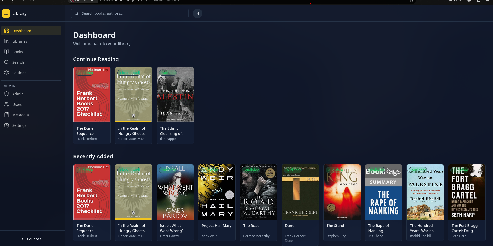

# Todds Library

> Self-hosted ebook & audiobook library server with AI transcription, word-level captions, and rich metadata.

Todds Library is a personal, self-hosted media manager for your book collection — think "Jellyfin for books." It scans folders of ebooks and audiobooks, builds a browsable library with full-text search, streams audiobooks with HLS, renders ebooks in the browser, and uses **Faster-Whisper** to generate **word-level karaoke subtitles** and **auto-detect chapters** for audiobooks.


It runs as a small Docker Compose stack: a Python **FastAPI** backend, a **Next.js** frontend, and supporting services (PostgreSQL, Redis, Meilisearch, and an optional Goodreads metadata mirror).




---

## Table of Contents

- [Features](#features)
- [Architecture](#architecture)
- [Repository layout](#repository-layout)
- [Tech stack](#tech-stack)
- [Quick start](#quick-start)
- [Prerequisites](#prerequisites)
- [Configuration](#configuration)
- [Development](#development)
- [Docker deployment](#docker-deployment)
- [AI / ASR subsystem](#ai--asr-subsystem)
- [API overview](#api-overview)
- [Testing](#testing)
- [Troubleshooting](#troubleshooting)
- [Known limitations](#known-limitations)
- [License / acknowledgements](#license--acknowledgements)

---

## Features

### Library management
- **Folder-based libraries** — point a library at any directory; support `ebook`, `audiobook`, and `mixed` library types.
- **Intelligent scanning** — recognizes `Author/Title/` and `Author/Title/Chapters/` folder layouts, groups multi-track audiobooks and chapter folders into a single book, and **merges an ebook + audiobook pair in the same folder into one "dual-format" book**.
- **File formats** — EPUB, PDF, MOBI, CBZ, CBR for ebooks; MP3, M4A/M4B, FLAC, OGG, AAC, WMA for audiobooks.
- **Per-user libraries** — every user sees only the libraries they own; books, progress, and bookmarks are scoped to the current user.

### Reading
- **In-browser EPUB reader** (epub.js) with four themes (light, dark, sepia, OLED-dark), font-size control, in-book search, TOC sidebar, bookmarks, page swiping, click zones, arrow-key paging, fullscreen, and **progress syncing** (CFI locations persisted to the server).
- **PDF viewer** with download support.
- **Continue Reading** dashboard — surfaces in-progress books sorted by last activity.

### Audiobooks
- **HLS streaming** via ffmpeg-transcoded AAC segments with graceful fallback to native/MP3/M4B playback and multi-track seeking.
- **Word-level karaoke captions** — subtitles generated by Whisper render with per-word highlighting, in inline, overlay, and immersive fullscreen "page-flip" modes.
- **Sleep timer** (15/30/45/60 min or "end of chapter"), playback speed 0.5–3×, chapter list with click-to-seek.
- **Smart Read ↔ Listen routing** — dual-format books redirect to the right viewer.

### AI / ASR
- **Faster-Whisper transcription** (GPU-accelerated via CUDA/CTranslate2) generates SRT, VTT, and word-timed JSON subtitles per chapter.
- **Automatic chapter detection** from silence gaps in whisper timestamps — with an option to reuse existing subtitle timestamps instead of re-transcribing.
- **Chunked transcription** for long source files (30-minute chunks with timestamp offset stitching and resume-from-partials).
- **Generation logs** — a live, polled feed of transcription status with progress heartbeats, plus bulk generation and cancellation.

### Search & metadata
- **Full-text search** powered by **Meilisearch** (title, author, series, description) with per-user filtering and automatic SQL fallback.
- **Metadata enrichment** from **OpenLibrary, Google Books, Audible, ISBNdb**, and **rreading-glasses** (a self-hosted Goodreads API mirror); results are cached per-book and can be applied with one click from the admin panel.
- Cover art download and storage.

### Auth & administration
- **First-run setup** — the first registered user becomes the admin.
- **Local username/password auth** (bcrypt) and optional **Authentik OIDC SSO**.
- **Admin panel** — stat cards, library overview/scan, user management (create/edit/delete, guard against removing the last admin), metadata editor with lookup, and the ASR system-settings console.

---

## Architecture

```
                        ┌─────────────────────────────┐
                        │      Next.js Frontend       │
                        │  (NextAuth, React Query,     │
                        │   Zustand player, readers)   │
                        └──────────────┬──────────────┘
                                       │  /backend-api proxy
                                       │  (http://backend:8000/api)
                        ┌──────────────▼──────────────┐
                        │        FastAPI Backend      │
                        │  auth · libraries · books    │
                        │  audiobooks · search · meta  │
                        │  asr/generate · settings     │
                        └───┬──────┬──────┬──────┬────┘
                            │      │      │      │
               ┌────────────┼──────┼──────┼──────┼────────────┐
               ▼            ▼      ▼      ▼      ▼            ▼
        ┌────────────┐ ┌────────┐ ┌───────────┐ ┌──────────┐ ┌──────────────┐
        │ PostgreSQL │ │ Redis  │ │ MeiliSearch│ │  ffmpeg  │ │ rreading-    │
        │  16        │ │ 7      │ │ v1.7      │ │  (HLS)   │ │ glasses (GR) │
        └────────────┘ └────────┘ └───────────┘ └──────────┘ └──────────────┘
```

Key flows:

- **Browse / read** — the frontend calls the backend through an `afterFiles` Next.js rewrite (`/backend-api/*` → `http://backend:8000/api/*`), so the browser stays same-origin in production.
- **Search** — the backend queries Meilisearch scoped to the current user's libraries, falling back to a SQL query if Meilisearch is unavailable.
- **Streaming** — the backend lazily transcodes audiobooks to HLS with ffmpeg on first play, then serves `.m3u8` playlists and MPEG-TS segments (cached under the covers volume).
- **Subtitles / chapters** — ASR runs on the GPU inside the backend container, writes SRT/VTT/JSON next to the book (`subtitles/<book_id>/`), and records metadata + generation logs in the database.

---

## Repository layout

```
todds-library/
├── apps/
│   ├── backend/                # Python 3.12 FastAPI service
│   │   ├── app/
│   │   │   ├── api/            # Routers (auth, books, libraries, audiobooks, ...)
│   │   │   ├── models/         # SQLAlchemy ORM models
│   │   │   ├── schemas/        # Pydantic request/response schemas
│   │   │   ├── services/       # Business logic (scanner, ASR, metadata, ...)
│   │   │   ├── scanner/        # File parsers (epub, pdf, cbz, audio)
│   │   │   ├── metadata/       # Metadata provider clients
│   │   │   └── transcoder/     # ffmpeg HLS transcoding
│   │   ├── alembic/            # DB migrations
│   │   └── tests/              # pytest suite (SQLite + fakeredis)
│   └── frontend/               # Next.js 14 App Router UI
│       └── src/
│           ├── app/            # Routes, layouts, providers
│           ├── components/     # Books, reader, player, ui (shadcn-style)
│           ├── hooks/          # React Query hooks + Zustand store
│           ├── lib/            # API client, auth options, utils
│           └── types/          # Re-exports from shared-types
├── packages/
│   └── shared-types/           # Zod schemas + TS types (frontend contract)
├── tests/
│   └── e2e/                    # Playwright end-to-end tests
├── docker-compose.yml          # Full stack
├── docker-compose.e2e.yml      # Isolated e2e overlay
├── docker-compose.gpu.yml      # GPU build overlay
├── Makefile                    # Dev / build / migrate helpers
├── pnpm-workspace.yaml         # apps/* + packages/*
└── turbo.json                  # Turborepo pipeline
```

---

## Tech stack

| Layer        | Technology |
|--------------|------------|
| Frontend     | Next.js 14 (App Router), React 18, TypeScript |
| UI           | Tailwind CSS v3, shadcn/ui-style components (Radix primitives), lucide-react icons |
| Client state | TanStack React Query v5, Zustand (player) |
| Auth         | NextAuth v4 (credentials + Authentik OIDC) |
| Backend      | Python 3.12, FastAPI, uvicorn |
| ORM / DB     | SQLAlchemy 2.0 (async), asyncpg, PostgreSQL 16 |
| Search       | Meilisearch 1.7 |
| Cache/session| Redis 7 (sessions with sliding TTL) |
| ASR          | faster-whisper (CTranslate2), PyTorch (CUDA 12.4+) |
| Transcoding  | ffmpeg (HLS, audio sanitization) |
| Metadata     | OpenLibrary, Google Books, Audible, ISBNdb, rreading-glasses |
| Tooling      | pnpm 8 + Turborepo, Alembic, Docker Compose |

---

## Quick start

1. **Clone & configure**

   ```bash
   git clone <repo-url> todds-library
   cd todds-library
   cp .env.example .env
   # edit .env — set SECRET_KEY, NEXTAUTH_SECRET, MEILI_MASTER_KEY, BOOKS_DIR, etc.
   ```

2. **Point it at your books**

   Set `BOOKS_DIR` (or mount a volume) to the folder containing your ebooks/audiobooks, e.g.:

   ```bash
   # docker-compose.yml backend volume
   # - ${BOOKS_DIR:-/mnt/media/books}:/books
   ```

3. **Start the stack**

   ```bash
   docker compose up -d
   # or, with GPU ASR:
   docker compose --profile gpu up -d
   ```

4. **Open the app**

   Browse to <http://localhost:3330> (or `${FRONTEND_PORT}`). On first run you'll be taken to `/register` to create the **first (admin) user**.

5. **Add a library & scan**

   Go to **Admin → Libraries** (or **Libraries** page) and add the container path `/books/<subfolder>`. The library is scanned automatically on creation; use **Scan** to re-scan later. Metadata enrichment runs during scanning.

---

## Prerequisites

### Docker (recommended)
- **Docker** with Compose v2.
- **NVIDIA GPU** + drivers for CUDA **12.4+** if you want GPU-accelerated Whisper transcription. The compose file requests two GPU devices by default (`deploy.resources.reservations.devices`). For CPU-only transcription, override `ASR_DEVICE=cpu` and remove the `deploy.resources` block (or set `ASR_DEVICE=auto`, which falls back to CPU).
  - Note: the backend Dockerfile **fails the build** if the installed torch does not report CUDA 12.3+ and cuDNN 9.x — this is intentional for GPU images. For CPU-only builds, install torch from the default index instead of `cu124`.

### Host development (optional)
- **Node.js 18+**, **pnpm 8** (`corepack enable`), **Python 3.11+**, and **ffmpeg** on `PATH`.
- PostgreSQL, Redis, and Meilisearch (or run them with `docker compose up -d postgres redis meilisearch`).

---

## Configuration

Copy `.env.example` → `.env`. All variables are optional; sensible defaults are provided.

| Variable | Description | Default |
|---|---|---|
| `POSTGRES_DB` / `POSTGRES_USER` / `POSTGRES_PASSWORD` | PostgreSQL credentials | `todds_library` / `todds` / `todds_secret` |
| `MEILI_MASTER_KEY` | Meilisearch master key | `todds_meili_master_key` |
| `MEILI_ENV` | Meilisearch env (`development`/`production`) | `production` |
| `AUTHENTIK_ISSUER` / `AUTHENTIK_CLIENT_ID` / `AUTHENTIK_CLIENT_SECRET` | Authentik OIDC (leave blank for local auth only) | empty |
| `SECRET_KEY` | Backend JWT / encryption secret (`openssl rand -hex 32`) | `change_me_in_production` |
| `UVICORN_WORKERS` | Backend worker processes | `1` |
| `BACKEND_PORT` | Host port for the backend API | `8830` |
| `RREADING_GLASSES_IMAGE` | Metadata mirror image (Goodreads-backed) | `blampe/rreading-glasses:latest` |
| `RREADING_GLASSES_PORT` | Host port for rreading-glasses | `8788` |
| `RREADING_GLASSES_POSTGRES_*` | rreading-glasses database creds | `rreading-glasses` / `change-me` |
| `RREADING_GLASSES_HARDCOVER_AUTH` | Bearer token if using the Hardcover-backed image | empty |
| `NEXTAUTH_URL` | Public URL for the frontend | `http://toddheadquarters:3330` (compose) |
| `NEXTAUTH_SECRET` | NextAuth signing secret | `change_me_in_production` |
| `NEXT_PUBLIC_API_URL` | Browser-facing API base (relative path proxies via Next) | `/backend-api` |
| `API_INTERNAL_URL` | Server-side (NextAuth) backend URL | `http://backend:8000/api` |
| `FRONTEND_PORT` | Host port for the frontend | `3330` |
| `BOOKS_DIR` | Local path mounted at `/books` inside the backend | `./books` |

### Backend ASR env vars (docker-compose)

| Variable | Description | Default |
|---|---|---|
| `ASR_MODEL_ID` | Whisper model (`tiny`…`turbo`, `small` default) | `small` |
| `ASR_DEVICE` | `auto` / `cuda` / `cpu` | `cuda` (compose) |
| `ASR_GPU_INDEX` | CUDA device index | `0` |
| `ASR_COMPUTE_TYPE` | `float32` / `float16` | `float32` |
| `ASR_MODELS_DIR` | Model cache directory | `/data/asr_models` |

> Runtime ASR settings (model, device, batch size, chunk length, VAD filter, generation mode, language) are also editable **at runtime** via `Admin → Settings` and persisted in the `system_settings` table.

---

## Development

The Makefile wraps the common host workflows:

```bash
# Install everything (Python dev deps + pnpm + run migrations)
make bootstrap

# Run the DB services only (Postgres, Redis, Meilisearch) in Docker
make dev-db

# Run backend + frontend in parallel on the host
make dev                 # = dev-db + dev-backend + dev-frontend

# Individual processes
make dev-backend         # uvicorn on :8830 (reload)
make dev-frontend        # pnpm --filter frontend dev (Next on :3000)
```

### Direct commands

```bash
# Backend (from apps/backend)
cd apps/backend && pip install -e ".[dev]"
uvicorn app.main:app --reload --host 0.0.0.0 --port 8830

# Frontend (from repo root)
pnpm --filter frontend dev

# Database migrations
cd apps/backend && alembic upgrade head        # apply
cd apps/backend && alembic revision --autogenerate -m "msg"   # new migration

# Lint / typecheck / build / clean (Turborepo pipelines)
pnpm lint
pnpm typecheck
pnpm build
pnpm clean
```

> During host development the backend needs Postgres, Redis, and Meilisearch reachable — `make dev-db` starts them in Docker. The backend reads `DATABASE_URL`, `REDIS_URL`, and `MEILI_URL` from its own `.env`.

---

## Docker deployment

### Full stack (`docker-compose.yml`)

| Service | Image / build | Port | Purpose |
|---|---|---|---|
| `postgres` | `postgres:16-alpine` | — | Primary database |
| `redis` | `redis:7-alpine` | — | Sessions + queue glue |
| `meilisearch` | `getmeili/meilisearch:v1.7` | — | Full-text search |
| `backend` | `./apps/backend` (Dockerfile) | `${BACKEND_PORT:-8830}:8000` | FastAPI API + ASR |
| `rreading-glasses-db` | `postgres:17-alpine` | — | Metadata mirror DB |
| `rreading-glasses` | `blampe/rreading-glasses:latest` | `${RREADING_GLASSES_PORT:-8788}:8788` | Goodreads metadata mirror |
| `frontend` | `.` → `apps/frontend/Dockerfile` | `${FRONTEND_PORT:-3330}:3000` | Next.js UI |

Networks: `internal` (backend ↔ datastores, isolated) and `frontend` (frontend ↔ backend). The backend reserves two NVIDIA GPUs for ASR.

### Building standalone images

```bash
make build          # todds-library-backend + todds-library-frontend
```

### GPU overlay

`docker-compose.gpu.yml` pins the torch build to CUDA 12.4 wheels (`TORCH_INDEX_URL=https://download.pytorch.org/whl/cu124`). The main compose already does this, so the overlay is only needed if you strip it from the main file.

### E2E overlay

`docker-compose.e2e.yml` reuses the prebuilt `todds-library-backend` / `todds-library-frontend` images with isolated data and ports (defaults `:3331` / `:8831`) — see [Testing](#testing).

### Common operations

```bash
docker compose up -d              # start all services
docker compose logs -f            # follow logs
docker compose ps                 # service status
docker compose down               # stop (keep volumes)
docker compose down -v            # stop + wipe volumes
docker compose build --no-cache   # rebuild everything
```

---

## AI / ASR subsystem

The ASR pipeline is the standout feature. It lives in the backend (`app/services/asr_service.py`, `app/services/chapter_service.py`) and is exposed through the `asr` and `generate` routers.

### How transcription works

1. A chapter's audio is resolved (multi-track books map chapter *n* → track *n*).
2. If the source is long (> 30 min), it's split into 30-minute chunks transcribed with **timestamp offset stitching** and **resume-from-partials** so interrupted runs can continue.
3. faster-whisper transcribes each chunk (model/device/batch/VAD controlled by system settings).
4. Output is written as **SRT**, **VTT**, and **word-timed JSON** to `<book>/subtitles/<book_id>/chapter_XXXX.*`.
5. A `SubtitleMetadata` row records language, model, cue/word counts, and paths; `GenerationLog` rows stream progress with 30-second heartbeats.

### Chapter detection

- Splits whisper segments at **silence gaps** (default threshold `3.0s`, tunable via `chapter_gap_threshold_sec`).
- Titles are generated from the first sentence of each detected section.
- If subtitles already exist, their timestamps are reused to avoid re-transcribing.
- Multi-track audiobooks are skipped (they already have per-track chapters).

### Generation modes

- **Manual** — per-chapter or per-book from the player/detail UI.
- **Auto (new)** / **Auto (all)** — kick off automatically after library scans for newly added or all audiobooks.
- **Bulk** — `POST /settings/generate-all-subtitles` / `generate-all-chapters` process every audiobook.
- **Cancellation** — a running job stops at the next chapter boundary.

### Hardware requirements

- GPU strongly recommended. The backend image verifies torch reports CUDA 12.3+ and cuDNN 9.x at build time.
- CPU transcription works but is slow; set `ASR_DEVICE=cpu` or `auto`.

---

## API overview

The backend exposes a REST API under `/api` (interactive docs at `GET /api/docs` via FastAPI/Swagger). Auth uses `Authorization: Bearer <access_token>` (short-lived JWT) with a `session_token` for refresh (Redis-backed, 30-day sliding TTL). Media endpoints (`/cover`, `/download`, `/stream`) additionally accept `?access_token=<token>` for `<audio>`/`` tags.

Full endpoint reference is documented in [`apps/backend/README.md`](apps/backend/README.md).

| Area | Key endpoints |
|---|---|
| Auth | `POST /auth/login`, `POST /auth/register` (first user = admin), `POST /auth/authentik`, `POST /auth/refresh`, `POST /auth/logout`, `GET /auth/me`, `GET /auth/setup/status`, `GET|POST|PATCH|DELETE /auth/users` (admin) |
| Libraries | `GET /libraries`, `GET /libraries/directories` (admin), `POST /libraries` (admin), `GET /libraries/{id}`, `DELETE /libraries/{id}` (admin), `POST /libraries/{id}/scan` (admin) |
| Books | `GET /books`, `GET /books/{id}`, `GET /books/{id}/cover`, `GET /books/{id}/download`, `POST|GET /books/{id}/progress`, `POST /books/{id}/bookmarks`, `GET /books/{id}/bookmarks`, `DELETE /books/{id}/bookmarks/{bm}` |
| Audiobooks | `GET /audiobooks/{id}/download?track=N`, `GET /audiobooks/{id}/stream`, `GET /audiobooks/{id}/stream/{segment}`, `GET /audiobooks/{id}/cover` |
| Search | `GET /search?q=&type=&limit=&offset=` |
| Metadata | `POST /metadata/refresh/{id}`, `POST /metadata/refresh/library/{id}`, `GET /metadata/lookup/{id}`, `POST /metadata/apply/{id}`, `PUT /metadata/{id}` (all admin) |
| ASR | `POST /books/{id}/chapters/{cid}/transcribe`, `GET /books/{id}/chapters/{cid}/subtitles?format=srt\|vtt\|json` |
| Generate | `POST /books/{id}/chapters/{cid}/generate/subtitles`, `POST /books/{id}/generate/subtitles`, `GET /books/{id}/generate/subtitles/status`, `POST /books/{id}/generate/chapters` |
| Settings | `GET|PUT /settings`, `POST /settings/generate-all-subtitles`, `POST /settings/generate-all-chapters`, `POST /settings/cancel-generation`, `GET /settings/generation-logs` (all admin) |
| Health | `GET /health` |

---

## Testing

### Backend unit/integration tests (pytest)

FastAPI tests run against **SQLite** (`sqlite+aiosqlite`) and **fakeredis** — no external services needed.

```bash
cd apps/backend
pip install -e ".[dev]"
pytest
```

Covers ASR service internals, auth & JWT/session flows, book access scoping, chapter detection, subtitle generation, HLS transcoding, library scanner, metadata providers, and sessions. See `apps/backend/tests/`.

### End-to-end tests (Playwright)

```bash
pnpm test:e2e                  # defaults to http://localhost:3330
E2E_BASE_URL=http://localhost:3331 pnpm test:e2e -- --grep isolated-setup
```

The suite (`tests/e2e/`) mixes two strategies:

- **Mocked backend** — `page.route('**/backend-api/**')` intercepts API calls; auth is seeded by minting a real NextAuth JWT cookie. Fast for layout/UI/flow assertions.
- **Live stack** — runs against real dockerized services. Some specs require an auth fixture minted inside the running backend container (`E2E_AUTH_FIXTURE`) or a pre-seeded books volume (`prepare-media-fixtures.py`).

Key env vars: `E2E_BASE_URL` (`:3330`), `E2E_API_URL` (`:8830/api`), `E2E_USERNAME`/`E2E_PASSWORD` (`e2eadmin`/`e2e-password`), `E2E_USE_MOCKS=1`, `E2E_BOOKS_DIR`.

To run an isolated e2e stack (matching `isolated-setup.spec.ts` defaults `:3331`/`:8831`):

```bash
docker compose build                 # todds-library-backend/frontend images
docker compose -f docker-compose.yml -f docker-compose.e2e.yml up -d
E2E_BASE_URL=http://localhost:3331 E2E_API_URL=http://localhost:8831/api pnpm test:e2e
```

---

## Troubleshooting

| Symptom | Fix |
|---|---|
| Backend container exits / build fails on CUDA | The Dockerfile requires torch with CUDA 12.3+ and cuDNN 9.x. Ensure the NVIDIA driver + Docker GPU runtime are present, or build a CPU-only image (default torch index, `ASR_DEVICE=cpu`, remove the `deploy.resources` GPU block). |
| Books don't show up after scan | Check the books volume mount (`${BOOKS_DIR}:/books`) matches the library path you added inside the container. Confirm the library type matches your files (`ebook` vs `audiobook` vs `mixed`). |
| No search results | Meilisearch must be healthy (`docker compose ps`). The API falls back to SQL search automatically if Meili is down, but sorting/typo-tolerance degrade. |
| "Invalid username or password" | You're using local auth — create the first user via `/register` on a fresh database, or configure Authentik. |
| Login succeeds but requests 401 | The access token is short-lived (60s). The frontend auto-refreshes via the session token; if you're hitting the API manually, call `POST /auth/refresh` with `{ session_token }` or re-login. |
| Subtitles never finish / generation stuck | Check `/settings/generation-logs` for status and the backend logs. Interrupted "started" logs are recovered as failed on restart. On CPU, transcription is slow — prefer GPU. |
| Can't reach the frontend from another machine | Set `NEXTAUTH_URL` to the externally reachable URL and open `${FRONTEND_PORT}`. |
| Port conflicts | Change `BACKEND_PORT` / `FRONTEND_PORT` / `RREADING_GLASSES_PORT` in `.env`. |

---

## Known limitations

- **`@todds-library/shared-types` is currently frontend-only.** The Python backend defines its own Pydantic models (snake_case) and never imports the shared package (camelCase), so the "shared" contract currently flows in one direction. In practice the two layers are kept in sync manually.
- **Settings page "Reading Preferences" controls are non-functional** — the dark/light/sepia theme + font-size selects on `/settings` do not persist.
- **Legacy / unused frontend components** — `components/search/search-bar.tsx` and `components/player/player-controls.tsx` are exported but not imported anywhere; `components/books/book-detail.tsx` duplicates the active book-detail page; `src/app/login/page.tsx.backup` is a stale file not part of the build.
- **`apps/backend/Dockerfile.dev` references `entrypoint.sh`** which does not exist in the repo (the production image uses `entrypoint.py`).
- **Celery is a declared dependency but unused** (generation runs in-process via FastAPI background tasks).
- **Search bar keyboard shortcut (Cmd/Ctrl+K)** is defined but not wired into the header.
- PDF reader does not sync reading progress.
- The `.gitignore` does not ignore the root `test-output/` and `test-results/` Playwright artifact directories.

---

## License / acknowledgements

- **faster-whisper** / **Whisper** — speech recognition models and runtime.
- **epub.js**, **hls.js**, **react-h5-audio-player** — frontend media rendering.
- **rreading-glasses** (`blampe/rreading-glasses`) — self-hosted Goodreads metadata mirror.
- **Authentik** — optional OIDC identity provider.
- **Meilisearch**, **Radix UI**, **Tailwind CSS**, **Next.js**, **FastAPI** — core infrastructure.

This is a personal project. No official license is attached to the repository; see the project owner for usage terms.
